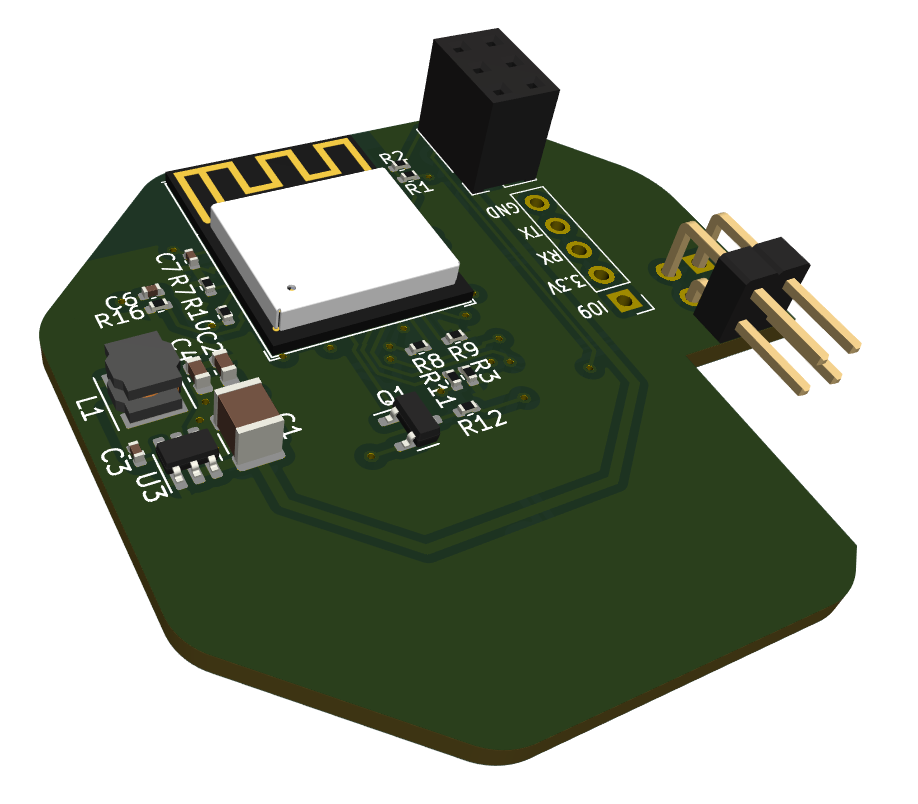
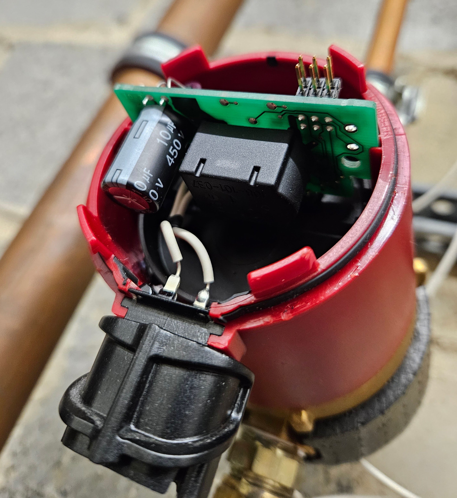
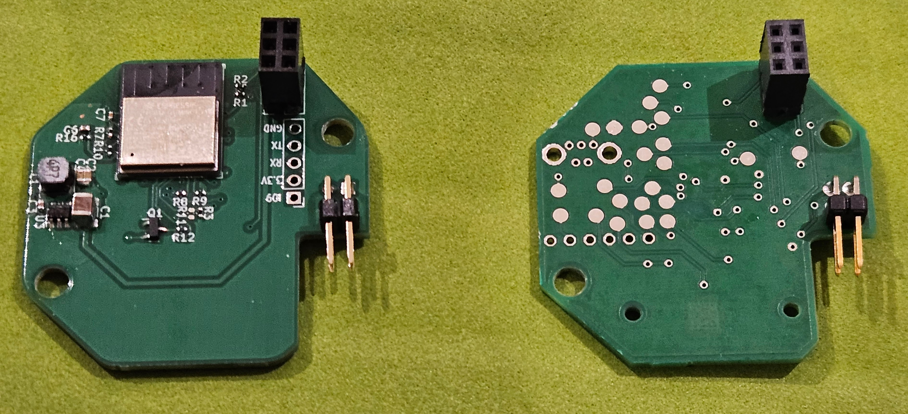
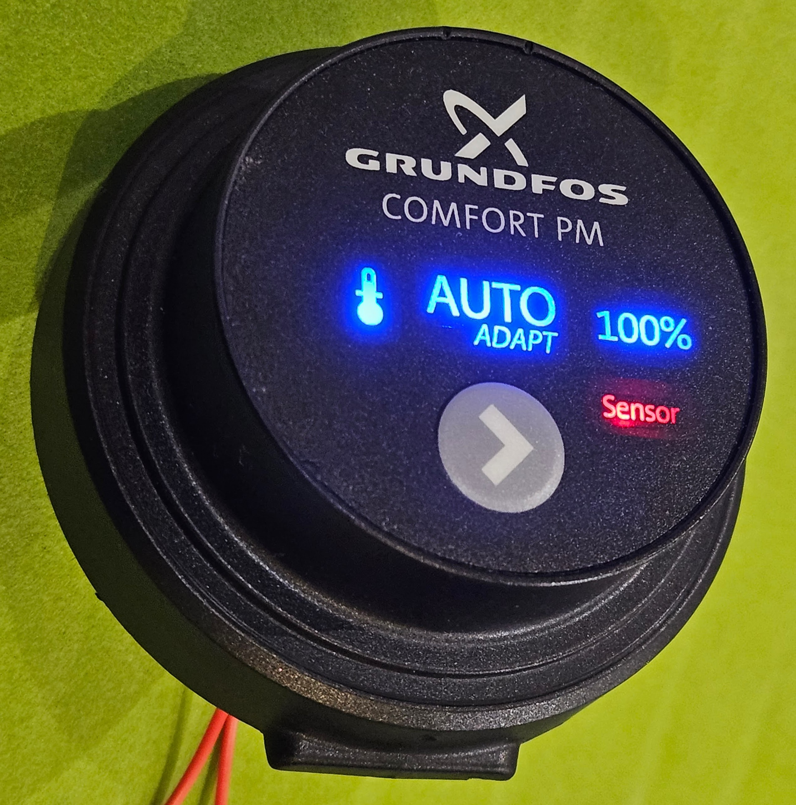
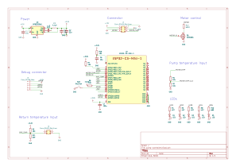

# ESP32 pump controller for Grundfos Comfort AutoAdapt recirculating hot water pump

This project contains a KiCad project for a replacement controller board that I
built for a Grundfos Comfort AutoAdapt recirculating hot water pump using an
ESP32-C3-MINI-1 board. This allows the pump to be controlled remotely, and
integrated in to Home Assistant using [ESPHome][esphome].  There's some more information 
on this in the [Home Assistant community forum](https://community.home-assistant.io/t/hacking-a-grundfos-comfort-autoadapt-recirculating-hot-water-pump-for-esphome/684475).



The AutoAdapt pump is supposed to predict when you need hot water based on
previous usage patterns, but it never worked reliably for me. I originally
planned to put the pump into "always on" mode and use an external relay to
control it from Home Assistant, but unfortunately, every time you cut the power
to the pump, it reverts to AutoAdapt mode. I originally started
reverse-engineering the pump to figure out if it was possible to force it to be
always on (you can quite easily) but then got a bit carried away with a better
solution.

_Obvious warnings: copy this at your own risk. The board was designed based on
reverse engineering of the original board, so it's quite possible that I missed
some important safety considerations when doing so. The pump is mains powered,
so disconnect it before disassembly, and be aware that capacitors on the the
power supply board may still hold charge. If you don't understand what this
means, stop now._

## Original control board

The pump contains 3 PCBs. The front board is the control board. The middle
board is the power supply, and the rear board is the motor driver.

The modular design of the PCBs makes it quite easy to swap in a different
control board that re-uses the existing power supply and motor driver boards.

The power supply board provides 14V to the other two boards. The motor board
provides a 5V supply which is used by the microcontrollers on both the motor 
board and the control board.

The control board connects to the power supply board via a six pin connector
with the following pins (facing the control board connector):

```
+---------+---------+---------+
|  Temp   |   5V    |    0V   |
+---------+---------+---------+
|  Motor  |   ??    |   14V   |
+---------+---------+---------+
```

The original controller uses a PIC18F14K50 microcontroller.

The motor control appears to be an active-high, open-drain arrangement, meaning that the
controller pulls it to ground to turn the motor off, and lets it float (pulled up by PSU board) to 
turn it on. This means that if you simply remove the control board, the pump will
run all the time. The circuit on the motor controller looks like this may actually be treated 
as an analog input, possibly allowing control of motor speed.

I'm unsure of the details of the pump temperature sensor, beyond that it gives an
analog signal that varies with the temperature of the pump.  The replacement
board feeds it into a potential divider to ensure that it remains < 3.3V, and I
then calibrated it empirically. This is used to measure the temperature of
water flowing out of the tank.

The `??` pin is connected to the analog ground reference voltage input (AVss)
on the microcontroller (30F2010) on the motor driver board. It's connected to ground
on the controller board, but appears to be pulled up to 5V by the PSU board.  I
don't understand this arrangement. The replacement board just connects it to ground
as per the original.

The other input to the board is from an external temperature sensor used to
measure the temperature of returning water. This is a simple 10K NTC, and
connects via 2 pins on a 4 pin header.

### Pump variants

This pump is sold in a few different variants with different controllers. My
guess is that these are identical internally except for the front control board
and face plate. The advantage of the "AutoAdapt" variant is that it has the
external return temperature sensor.

## Disassembly

The front of the pump is held on by four clips, and can be removed by carefully
levering behind the face plate around the circumference of the pump.  



The external temperature sensor is coiled around the face plate, and is also just
clipped on. Once removed, it can be unplugged from the board (I think there may
have been a spot of glue originally), and then the original PCB can be removed - it's 
held in by 4 clips which need to be gently bent back.

At this point, the power supply board can also be removed by pulling on it, but
you don't need to.

The motor driver PCB is hidden under a plastic cover that is _extremely_ hard
to remove, but you definitely don't need to.

## ESP32 control board

The replacement board uses an ESP32-C3-MINI-1 module. It has its own buck
regulator supply to drop the 14V input to 3.3V, as the 5V linear regulator
supply from the motor controller is almost certainly insufficient for the
ESP32.

The power supply uses an AP63203, and can be populated using the components
from a [SparkFun BabyBuck Regulator Breakout Board](https://thepihut.com/products/sparkfun-babybuck-regulator-breakout-3-3v-ap63203).



The other parts of the board are:

### Motor driver

This uses an AO3400A MOSFET, and has a 680R series resistor because that's what
the original board had.

### Pump temperature input

This uses a potential divider to ensure that the input signal from the 5V
driver board remains less than 3.3V.

### Return temperature input

This uses a 10K resistor to form a potential divider.

### Switch input

The front panel switch pulls this to ground. The switch is a 2x3mm SMD tactile
switch.  I used a [CUI TS19-32-06-BK-70-1-SMT-TR-67](https://www.lcsc.com/datasheet/lcsc_datasheet_2312270104_CUI-TS19-32-06-BK-70-1-SMT-TR-67_C6723741.pdf).

### LED outputs

There are five LEDs on the front panel:

* Thermometer logo
* "Auto-adapt" logo (2 LEDs)
* "100%" logo
* "Sensor" logo

These are 0603 size LEDs.

I made the first four blue, and the last one red, and all have suitable
current-limiting resistors (0402).



### Connectors

The six pin connector for the power supply is an almost-standard 2x3 2.54mm
female header, but it's taller than normal. Obviously you could steal the
connector from the old board, but I wanted to keep the old one intact. I
managed to find some headers with extra long pins, and added some spacers taken
from other header pins.

The temperature connector is a standard 2x2 right angle 2.54mm pin header.

The board has holes for exposing the ESP32 UART and power, but I've not used
these. There may not be enough clearance between the back of the board and the
front panel if you fit these.

## Board revisions

I made a mistake in the design and connected the pump temperature input to
GPIO5/ADC2 which is apparently incompatible with enabling wifi on the ESP32-C3.
I fixed this by swapping GPIO4 and GPIO5 with jumper wires, and have updated
the PCB design in this repo to match, but this does mean that the PCB in this
repository has technically never been built or tested.

## Board fabrication / assembly

I got my boards made by PCBWay, and assembled them myself. Most resistors and
diodes are 0402 because I have lots of these already, but there's space to make
them bigger.

If hand-soldering 0402 components is not your idea of fun, you could probably
get the front of the board assembled by PCBWay / JLCPCB, leaving just the LEDs,
resistors and switch to do on the back, and the connectors.  You could fairly
easily increase the size of the resistors to make soldering easier.

## ESPHome

My ESPHome configuration is available [here](esphome/pump-controller.yaml).

## Schematic



[esphome]: https://esphome.io
